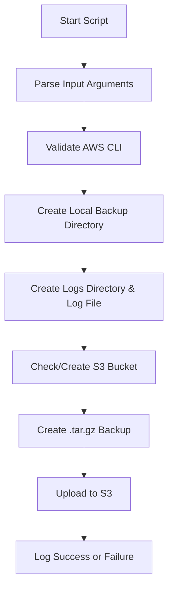

# 🗂️ System Config Backup to S3

This Bash script automates the backup of an ArcGIS Server configuration directory. It compresses the directory, stores it locally, and uploads it to an Amazon S3 bucket. It includes timestamped logging and automatic bucket creation if needed.

---

## 🚀 Features

- Backs up any specified ArcGIS Server configuration directory
- Creates timestamped `.tar.gz` archive
- Uploads backup to S3 (auto-creates bucket if missing)
- Logs all operations to a timestamped log file
- Supports default and custom input paths

---

## 🧪 Usage

```bash
./arcserver-dirs-bk-script.sh <source_directory> [local_backup_dir] [s3_bucket_name]
```

### 🔧 Arguments

| Argument            | Description                                                                 |
|---------------------|-----------------------------------------------------------------------------|
| `<source_directory>` | Directory to back up (default: `arc-server-directories`)                   |
| `[local_backup_dir]` | Local destination for backup (default: `<source_directory>_bk`)            |
| `[s3_bucket_name]`   | S3 bucket name (default: `gisoverflow`; if omitted, auto-named with timestamp) |

---

## 🧭 Workflow Diagram



---

## 📁 Output Structure

```
.
├── arc-server-directories/         # Source directory (example)
├── arc-server-directories_bk/      # Local backup directory
│   └── arcserver-config-backup-<timestamp>.tar.gz
├── logs/
│   └── Log-<timestamp>.log         # Detailed log of operations
```

---
## 🛡️ Requirements
- Cloud Provider : AWS
- sudo apt update
- sudo apt install coreutils
- IAM User with 
  - "AmazonS3FullAccess" policies attached to the EC2 instance
  - Programmatic access enabled
  - An Access Key ID and Secret Access Key generated for the IAM User
- IAM Role with "AmazonS3FullAccess" and "AmazonSSMFullAccess" policies attached to the EC2 instance
- AWS CLI v2 installed on the EC2 instance
- An S3 bucket created in your AWS account
- sudo / root for cron tab --> */2 * * * * root /home/ubuntu/backup-script.sh
- Finally User Permission to delete bucket or "Full Access" to S3
  - aws s3 rb s3://s3-bk-example --force

---
# Get Started 

```bash 
git clone https://github.com/your-org/arcgis-server-backup.git
cd arcgis-server-backup
chmod +x arcserver-dirs-bk-script.sh
```
```bash
aws --version
aws configure
```
```bash
# Basic usage with default values
./sys-dirs-bk-script.sh

# Custom source directory and bucket
./sys-dirs-bk-script.sh /opt/arcgis/server/config my-local-backup my-arcgis-bucket
```
## Output

```bash
📁 Log file created at ./logs/Log-2025-11-07-16-09-19.log
===================================================================
ArcGIS Server Configuration Backup Script
Name: Ahmed Alhusainy
Start Time: Fri Nov  7 04:09:19 PM EET 2025
Source Directory: arc-server-directories
Local Backup Directory: arc-server-directories_bk
S3 Backup Bucket: gisoverflow
===================================================================
{
    "BucketArn": "arn:aws:s3:::gisoverflow",
    "BucketRegion": "us-west-2",
    "AccessPointAlias": false
}

🪣 S3 bucket already exists: gisoverflow

📦 Creating backup file: arcserver-config-backup-2025-11-07-16-09-19.tar.gz
✅ Backup created at arc-server-directories_bk/arcserver-config-backup-2025-11-07-16-09-19.tar.gz
🚀 Uploading backup to S3: s3://gisoverflow/arcserver-config-backup-2025-11-07-16-09-19.tar.gz
✅ Backup uploaded successfully to s3://gisoverflow/arcserver-config-backup-2025-11-07-16-09-19.tar.gz

```